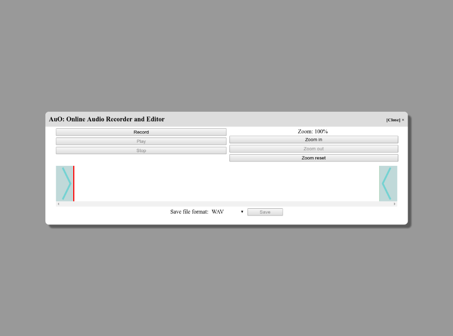
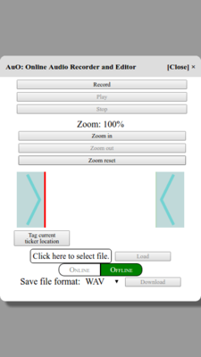

AuO version 1.6 (stable)
===
AuO (IPA: /ao/), a browser-based audio recording and editing application. Uses browser-native
technologies to avoid third-party dependencies.

# Licensing

AuO is released under the MIT License. See the LICENSE file in the repository for full license
details.

# Using AuO

Include AuO in any application by including AuO.js. Then, create an instance with

```javascript
const auo = new AuO(link_to_server_url, online_save_callback, local_save_callback);
```

where `link_to_server` is the URL to upload audio clips and `online_save_callback` is the callback
function used to process the server's response after uploading the saved audio file. Similarly, the
`local_save_callback` is invoked when the user chooses to save offline, and receives a blob as its
sole parameter. This triggers the download of the audio recording with the name `recording.ext`
where `ext` is the appropriate extension for the save format chosen from the UI.

To use the default callbacks (a modal dialog that displays the server's response
for online and a save prompt for local), either set the callbacks to `null` during construction, or
do not set them at all (they will default to `null`, then be replaced with their defaults).


To launch AuO, simply call

```javascript
auo.launch();
```

and the interface should appear. To suspend AuO, click Close or call

```javascript
auo.suspend();
```

to make the interface disappear and prevent resource use. When you are ready to use AuO once more,
call

```javascript
auo.launch();
```

again to relaunch the interface using the same instance.

## Supported Browsers and Operating Systems

<table>
    <tr><th style="border-top:0;border-left:0;">&nbsp;</th><th>Linux (Debian/Ubuntu)</th><th>Windows</th><th>Max OS X</th></tr>
    <tr><td>Chrome</td><td>49.0+<sup>[1]</sup></td><td>49.0+<sup>[1]</sup></td><td>49.0+<sup>[1]</sup></td></tr>
    <tr><td>Firefox</th><td>45.2+<sup>[2]</sup></td><td>45.2+<sup>[2]</sup></td><td>45.2+<sup>[2]</sup></td></tr>
    <tr><td>Edge</th><td>&#x2718;</td><td>&#x2718;</td><td>&#x2718;</td></tr>
    <tr><td>Internet Explorer</th><td>&#x2718;</td><td>&#x2718;</td><td>&#x2718;</td></tr>
    <tr><td>Opera</th><td>&#x2718;</td><td>&#x2718;</td><td>&#x2718;</td></tr>
    <tr><td>Safari</th><td>&#x2718;</td><td>&#x2718;</td><td>&#x2718;</td></tr>
</table>

Notes:

1. Chrome 49 does not support saving as WebM, so that save option is not shown in Chrome 49.
2. Firefox does not support loading some file formats, claiming that those formats are malformed.
3. At the moment, Safari, Opera, and Edge do not support the MediaRecorder API, which is required for capturing audio streams in JavaScript.

# The AuO User Interface

AuO currently supports audio recording, playback, editing, and saving to a remote server. Currently,
there is no support for saving to any format other than WebM and WAV, though many formats are
supported for loading. In addition, the user can also zoom in and out to focus on parts of the audio
clip. At the moment, AuO supports up to 16 levels of zoom, for a total magnification of
approximately 18.5 times the original view of the waveform.

## Initial Launch

When AuO first launches, the user will see only the options to record and zoom, since AuO has not
captured any audio data yet. The first thing the user should do at this stage is click the `Record`
button.



  
Above: Initial launch screenshots from a 1440px &times; 900px screen (larger laptop), 1280px &times;
950px screen (smaller laptop), and 360px &times; 640px screen (smartphone) in Google Chrome Version
51.0.2704.84 on Ubuntu Linux 14.04 (Trusty).

## Audio Recording

By clicking the `Record` button, the user can begin to gather audio feed live from the computer's
microphone, or potentially other connected audio recording devices as well. For first-time users, a
dialog box should appear in the browser to request permission to access the audio recording device,
and choose a device if the computer has multiple available devices. If this dialog box does not
appear, make sure that the browser's URL points to an `https://` URL (or `http://` if running on
localhost) and not a `file://` URL.

During recording, the user can zoom in and out, as well as reset the zoom to 100% if the current
zoom does not equal 100%.

To stop recording, the user can hit the `Stop` button. AuO will briefly pause to preprocess the
data for playbacks and saves, before entering the idle state. At this point, the browser's status
bar should also indicate that AuO is no longer using the microphone.

## Zooming

At any point during recording and playback, or when AuO is idling, the user can click the `Zoom in`
and `Zoom out` buttons to zoom in and out of the visualizer graph, respectively. The graph will
automatically resize and relabel the times accordingly. The user can also reset the zoom to the
default value of 100% by clicking the `Zoom reset` button.

Increasing the zoom allows the user to set trimmings and playback points more accurately;
decreasing the zoom allows the user to better navigate through the entire audio track.

## Panning

At any point, the user can pan by dragging the graphs where the ticker and trimming boxes do not
cover the graphs. Dragging from right to left will pan right, and dragging from left to right will
pan left.

## Idling

AuO's idle state occurs when AuO has a recording stored, but no active actions on that recording.
The user can identify this by seeing if a graph exists, and whether the `Record`, `Play`, and
`Upload` (or `Download`) buttons have been disabled. If the graph does not exist, then AuO has not
recorded anything yet and is not in the idle state; similarly, if any of the three mentioned buttons
has been disabled, then AuO is currently performing that action and is not in the idle state.


  
Above: Idle state screenshots from a 1440px &times; 900px screen (larger laptop), 1280px &times;
950px screen (smaller laptop), and 360px &times; 640px screen (smartphone) in Google Chrome Version
51.0.2704.84 on Ubuntu Linux 14.04 (Trusty).

In the idle state, the user can trim the audio clip from either end, as well as reposition the
ticker to begin playback at different parts of the audio recording.

## Ticker

The ticker is the red bar on the graph. This represents where AuO will begin playing the audio
recording when the user clicks `Play`. By moving this bar around, the user can allow AuO to begin
playing at different locations in the recording.

When hovering over the ticker, a label will appear next to the ticker to indicate the time that the
ticker is at.

### Tagging

At any point, users can tag the current location of the ticker by clicking the `Tag...` button. This
will pop up a modal that prompts the user for a string label. If an empty string is given, the label
will default to the time for that tag. Users can then return to that time in the idle state by
clicking the tag. Shift-clicking a tag will cause it to disappear, deleting it from the list of
current tags.


Additionally, tagging an already-tagged time will overwrite the previous label, and can be used to
update labels. Note that the default value for the label will always be the time; re-tagging and
then closing the modal will automatically relabel the tag with the time.

Furthermore, the call

```javascript
auo.getTags();
```

returns a map from the times (in integer milliseconds) to their string labels. Note that these times
are relative to the trimmed start at the time that the API call is made, and tags that fall outside
the playable range are not included in the map.

## Trimming Boxes

At either end of the graph, there is a blue box with an arrow pointing toward the graph, as shown in
the screenshots above. These are the trimming boxes. The one on the left is the start-trimming box,
and the one on the right is the end-trimming box. These boxes represent the start and end of the
trimmed audio recording, respectively, and if one were to save the recording, the produced audio
clip will contain only the audio between the two boxes.

Similar to the ticker, when hovering over the trimming boxes, a label will appear next to the inner
edge of the box, indicating the trimming. Note that the start-trimming box displays positive time
to indicate offset from the start, and the end-trimming box displays negative time to indicate
offset from the end.

## Audio Playback

By clicking the `Play` button, the user can play back the recorded audio file, starting at the red
ticker and ending at the end-trimming box. Once it reaches the end, AuO will automatically stop
playback and return to the idle state. If the user clicks play when the ticker is already at the
end-trimming box, the ticker will instead loop to the start-trimming box and play the entirety of
the trimmed audio.

## Audio Editing

Currently, AuO only supports audio editing by trimming.

### Trimming

To trim an audio recording, the user simply drags either the start-trimming box or the end-trimming
box to reposition the start and end of the recording, respectively. If this leaves the ticker in a
location that would not be played as a result of the trimming, the ticker will automatically move
with the trimming boxes. If the trimming was made in error, repositioning the trimming box without
playing the trimmed audio will allow the ticker to reposition itself as close to its original
position as it can.

# Loading and Saving

AuO has built-in functionality to allow users to load audio from and save audio to both the local
filesystem as well as external servers. This functionality is toggled through the resource marker,
which is between the Load and Save UIs. There are two options, `Online` and `Offline`, which
affects both loading and saving at the same time. The active mode is highlighted in green, while
the inactive mode is grayed out. By clicking on the two toggle options, the user can switch between
the two modes.

  
Above: The load and save UIs in online mode.

  
Above: The load and save UIs in offline mode.


## Audio Loading

Users can select an audio file to upload into the editor by clicking the area next to the `Load`
button. This will produce a popup window for selecting a file from the local filesystem to load into
the audio editor. After selecting a file, the name of the file to load will show up next to the
`Load` button. Clicking the now-enabled `Load` button will load the file into the editor. At this
point, the user can continue to use AuO as if the audio track had just been recorded.

The audio formats supported for loading are listed below:

- Advanced Audio Coding (AAC; .aac)
- Moving Pictures Experts Group (MPEG, MP3, MP4; .m4a, .m4p, .mp3, .mp4, .mpa, .mpe, .mpg, .mpeg)
- Ogg (OGG; .ogg, .ogv)
- Waveform Audio File Format (WAVE; .wav, .wave)
- WebM (WEBM; .webm)

## Audio Saving

When in online mode, the user can click the `Upload` button to save and upload the audio recording
to the server, which should reply with a link to the saved audio clip. The user can then retrieve
this link from the modal dialog that pops up when the saving has succeeded. Both the location of the
server to upload to and the callback handler upon a successful save can be changed by passing in the
appropriate parameters to AuO's constructor. If using a custom handler on successfuly save, the
handler should take an XMLHttpRequest object as its parameter, and the link should reside in the
response property of that object.

When in offline mode, the user can click the `Download` button to initiate a local file download
using the browser's file download prompt. This can be customized with a handler as well; this
handler should accept a JavaScript blob containing the audio data to save.

If the server URL has been omitted or set to null, then online saving is disabled, and the `Upload`
button will not be enabled.

Users can choose the format in which AuO will save the audio recording by selecting the format from
the dropdown menu next to the `Upload` or `Download` button.

Currently, for Chrome 49, only WAV is available, while for Chrome 50+, both WAV and WebM are
available.

### Callback Function

The callback function is the second parameter in the constructor for a new AuO instance, and is
optional. This callback function is called once the server has responded with an HTTP 2xx in
response to the user's save request. If this parameter is omitted during construction, AuO will use
the default callback function, which produces a modal dialog box with the server's response, as
shown in the image below:


If the parameter was provided during construction, AuO will call that function and pass in one
parameter: the XMLHttpRequest object, whose `response` field contains the server's response.

# Hotkeys

For convenience, AuO has hotkeys mapped to several of the main functions of AuO. They are mapped
below:

<table>
    <tr><th>Key combinations</th><th>Key description</th><th>Function</th></tr>
    <tr><td><kbd>&#x25C4;</kbd></td><td>Left arrow key</td><td>Move ticker left by 1 pixel, to an earlier time.</td></tr>
    <tr><td><kbd>&#x25BA;</kbd></td><td>Right arrow key</td><td>Move ticker right by 1 pixel, to a later time.</td></tr>
    <tr><td><kbd>Shift</kbd> + <kbd>&#x25C4;</kbd></td><td>Shift + left arrow key</td><td>Move ticker left by 100 pixels, to an earlier time.</td></tr>
    <tr><td><kbd>Shift</kbd> + <kbd>&#x25BA;</kbd></td><td>Shift + right arrow key</td><td>Move ticker right by 100 pixels, to a later time.</td></tr>
    <tr><td><kbd>Ctrl</kbd> + <kbd>&#x25C4;</kbd></td><td>Ctrl + left arrow key</td><td>Scroll waveform display left by 10 pixels, to an earlier time.</td></tr>
    <tr><td><kbd>Ctrl</kbd> + <kbd>&#x25BA;</kbd></td><td>Ctrl + right arrow key</td><td>Scroll waveform display right by 10 pixels, to a later time.</td></tr>
    <tr><td><kbd>[</kbd></td><td>Left square bracket key</td><td>Increase size of the start trimming box.</td></tr>
    <tr><td><kbd>]</kbd></td><td>Right square bracket key</td><td>Increase size of the end trimming box.</td></tr>
    <tr><td><kbd>Shift</kbd> + <kbd>[</kbd> (a.k.a. <kbd>{</kbd>)</td><td>Shift + left square bracket key (a.k.a. left curly brace)</td><td>Decrease size of the start trimming box.</td></tr>
    <tr><td><kbd>Shift</kbd> + <kbd>]</kbd> (a.k.a. <kbd>}</kbd>)</td><td>Shift + right square bracket key (a.k.a. right curly brace)</td><td>Decrease size of the end trimming box.</td></tr>
    <tr><td><kbd>+</kbd></td><td>Plus key</td><td>Zoom in.</td></tr>
    <tr><td><kbd>-</kbd></td><td>Minus key</td><td>Zoom out.</td></tr>
    <tr><td><kbd>0</kbd></td><td>Zero key</td><td>Zoom reset.</td></tr>
    <tr><td><kbd>f</kbd></td><td>F key</td><td>Focus on the ticker, centering the ticker in the display as much as possible without having the display go out of bounds.</td></tr>
    <tr><td><kbd>l</kbd></td><td>L key</td><td>Focus on the audio file loader. If in online mode, will focus on the URL input box. If in offline mode, will pop up file selector dialog.</td></tr>
    <tr><td><kbd>o</kbd></td><td>O key</td><td>Toggle between online/offline modes.</td></tr>
    <tr><td><kbd>r</kbd></td><td>R key</td><td>Begin recording an audio clip.</td></tr>
    <tr><td><kbd>s</kbd></td><td>S key</td><td>Save the trimmed audio clip in the mode (online/offline) that is currently active.</td></tr>
    <tr><td><kbd>t</kbd></td><td>T key</td><td>Tag the current ticker time.</td></tr>
    <tr><td><kbd>Space</kbd></td><td>Spacebar</td><td>Emulates clicking either the Stop or Play button, whichever one is enabled.</td></tr>
</table>

# Providing a backend for AuO

The code in receive.php provides a simple PHP server-side script for supporting online file uploads
from AuO. This code is reproduced below:

```php
<?php
/**
 * receive.php
 *
 * A simple server-side script to interact with AuO for saving audio clips to a server. Update
 * $HOSTNAME to match the server's hostname and this file is all good to go. Just ensure that the
 * script has the requisite permissions to write to the server.
 */

$HOSTNAME = "https://localhost";  // Set this differently if you have a different host server.

// Make sure that the script has write permissions here!
if (!is_dir("sounds")) {
    `mkdir sounds`;
}

// Necessary for cross-origin requests, if AuO is hosted under a different host name than this
// script.
header('Access-Control-Allow-Headers: content-type');
header('Access-Control-Allow-Origin: *');

// Content type information.
$content_type = $_SERVER["CONTENT_TYPE"];
preg_match('/^audio\/([^; ]+); codecs=([^ ]+)/', $content_type, $content_type_matches);
$save_format = $content_type_matches[1];

$raw = file_get_contents('php://input');

// Create a unique filename by md5 hashing.
$counter = 0;
do {
    $filename = md5(date('U') . $raw . (++$counter)) . ".$save_format";
} while (file_exists("sounds/$filename"));

file_put_contents("sounds/$filename", $raw);

// Will generate the correct link to the saved audio file.
$link = substr($_SERVER["PHP_SELF"], 0, strrpos($_SERVER["PHP_SELF"], "/"));
$link = "$HOSTNAME$link/sounds/$filename";

echo $link;
?>
```

# Development

AuO is currently developed and maintained by William Qian as part of his Master of Engineering
thesis project with Daniel Wendel and Eric Klopfer in the MIT Scheller Teacher Education Program.

Bugs and issues should be reported in the GitHub issues page for AuO at
https://github.com/wqian94/AuO/issues along with any helpful information that you can provide, such
as operating system, browser (name and version), and any screenshots or videos that can help
recreate the bug.
